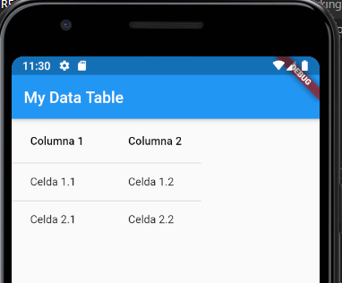
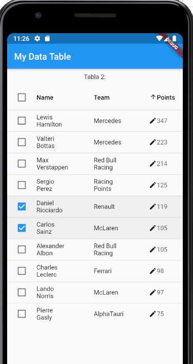

# Data Table

## Introducción
Mostrar datos en tablas es una práctica habitual para desarrolladores de aplicaciones. La información estructurada en filas y columnas ayuda a los usuarios a entenderla e interpretarla mejor.
Flutter proporciona al desarrollador el Widget DataTable con el objetivo de simplificar esta tarea. 

## A tener en cuenta
Se recomienda la utilización de este widget cuando se tienen unas pocas filas, dado los requerimientos que tiene.

## ¿Cómo se utiliza?
- Se añade el DataTable() Widget.
- Se definen las columnas en la propiedad columns del widget con un array de DataColumn con tantos elementos como columnas
- Se define las filas en la propiedad rows del widget con un array de DataRow con tantos elementos como filas.
- En cada fila se definen las celdas en la propiedad cells del DataRow con un array de DataCells con tantos elementos como celdas tenga la fila
- Hay que tener en cuenta que los DataColumn y los DataCell son también widgets!
### Ejemplo
Como en tantas ocasiones la mejor forma de explicarlo es mediante un ejemplo.
A continuación se muestra una tabla muy básica de 2 filas y 2 columnas:

```dart
DataTable(columns: const <DataColumn>[
      DataColumn(label: Text('Columna 1')),
      DataColumn(label: Text('Columna 2'))
    ], rows: const <DataRow>[
      DataRow(cells: <DataCell>[
        DataCell(Text('Celda 1.1')),
        DataCell(Text('Celda 1.2'))
      ]),
      DataRow(cells: <DataCell>[
        DataCell(Text('Celda 2.1')),
        DataCell(Text('Celda 2.2'))
      ])
    ]);
```



## Otros aspectos más avanzados

### Ordenación
Existen las propiedades sortColumnIndex y sortAscending del DataTable para permitir la ordenación por columnas.

- sortColumnIndex: es un valor entero que indica el número de columna comenzando por 0
- sortAscending: valor booleano para ordenar en order ascendente o descendente

La ordenación habrá que hacerla dentro de la propiedad onSort del DataColum. Allí habrá que programar cómo se hace esta ordenación. Se verá en el ejemplo final. Para no complicar el código de ejemplo, al ordenar se eliminan todas las selecciones de filas 

### Valores numéricos a las columnas
Con la propiedad numeric del DataColumn se puede indicar que una columna representa valores numéricos. En el próximo ejemplo se hará uso de ella.

### Seleccionar filas con un checkbox
- La propiedad selected de cada DataRow es un valor booleano que indica si una fila está marcada o no. En el ejemplo siguiente se emplea una condición para validar si se muestra marcada o no: 
```dart
selected: (selectedIndex.contains(drivers.indexOf(e)))
```
- En la propiedad onSelectChanged indicaremos la acción a realizar cuando se seleccione un DataRow. En el ejemplo siguiente veremos que actualizamos una lista de "filas seleccionadas". Si previamente estaba seleccionada lo sacamos de la lista y en caso contrario lo metemos en ella
```dart
onSelectChanged: (a) {
  setState(() {
    if (selectedIndex.contains(drivers.indexOf(e))) {
      selectedIndex.remove(drivers.indexOf(e));
    } else {
      selectedIndex.add(drivers.indexOf(e));
    }
  }
```
### Mostrar si una celda es editable
- La propiedad showEditIcon del DataCell admite un valor booleano para mostrar en caso que sea true, un icono que indica que la celda es editable. Unicamente es un icono, la celda no será editable porque esté este icono, deberemos hacerlo!
- La propiedad placeholder del DataCell indicará con un valor booleano si se muestra con aspecto de placeholder o no.

### Ejemplo final

Sin más, después de ver la sintáxis básica del widget DataTable de Flutter y de explicar algunas propiedades de los DataColumn, DataRow y DataCell lo mejor es mostrar un ejemplo.

Nótese que la selección de filas y la ordenación por columnas actualizan la pantalla y es necesario emplear estados. Por ello la clase implementada heredará de StatefulWidget


```dart
class Driver {
  String name;
  String team;
  int points;

  Driver({this.name, this.team, this.points});
}

var drivers = <Driver>[
  Driver(name: "Lewis Hamilton", team: "Mercedes", points: 347),
  Driver(name: "Valteri Bottas", team: "Mercedes", points: 223),
  Driver(name: "Max Verstappen", team: "Red Bull Racing", points: 214),
  Driver(name: "Sergio Perez", team: "Racing Points", points: 125),
  Driver(name: "Daniel Ricciardo", team: "Renault", points: 119),
  Driver(name: "Carlos Sainz", team: "McLaren", points: 105),
  Driver(name: "Alexander Albon", team: "Red Bull Racing", points: 105),
  Driver(name: "Charles Leclerc", team: "Ferrari", points: 98),
  Driver(name: "Lando Norris", team: "McLaren", points: 97),
  Driver(name: "Pierre Gasly", team: "AlphaTauri", points: 75)
];

class MyDataTableWidget extends StatefulWidget {
  
  @override
  MyDataTableWidgetState createState() {
    return new MyDataTableWidgetState();
  }
}

class MyDataTableWidgetState extends State<MyDataTableWidget> {
  List<int> selectedIndex = []; //List of selected rows
  int sortColumnIndex = null; // To not sort by column at start app
  bool sortAscending = true;
  bool selectedAll = false;

  @override
  Widget build(BuildContext context) {
    return SingleChildScrollView(
        child: Column(
            mainAxisSize: MainAxisSize.min,
            mainAxisAlignment: MainAxisAlignment.spaceBetween,
            children: [
          SizedBox(height: 10),
          Text("Tabla 2:"),
          SizedBox(height: 10),
          DataTable(
              sortColumnIndex: sortColumnIndex,
              sortAscending: sortAscending,
              columns: <DataColumn>[
                DataColumn(
                    label: Text("Name"),
                    numeric: false,
                    onSort: (i, b) {
                      setState(() {
                        sortAscending == true
                            ? drivers.sort((a, b) => a.name.compareTo(b.name))
                            : drivers.sort((a, b) => b.name.compareTo(a.name));
                        sortAscending = !sortAscending;
                        sortColumnIndex = 0;
                        selectedIndex.clear();
                      });
                    },
                    tooltip: "To display driver's name"),
                DataColumn(
                    label: Text("Team"),
                    numeric: false,
                    onSort: (i, b) {
                      setState(() {
                        sortAscending == true
                            ? drivers.sort((a, b) => a.team.compareTo(b.team))
                            : drivers.sort((a, b) => b.team.compareTo(a.team));
                        sortAscending = !sortAscending;
                        sortColumnIndex = 1;
                        selectedIndex.clear();
                      });
                    },
                    tooltip: "To display driver's team"),
                DataColumn(
                    label: Text("Points"),
                    numeric: true,
                    onSort: (i, b) {
                      setState(() {
                        sortAscending == true
                            ? drivers
                                .sort((a, b) => a.points.compareTo(b.points))
                            : drivers
                                .sort((a, b) => b.points.compareTo(a.points));
                        sortAscending = !sortAscending;
                        sortColumnIndex = 2;
                        selectedIndex.clear();
                      });
                    },
                    tooltip: "To display driver's points")
              ],
              rows: drivers
                  .map((e) => DataRow(
                          selected:
                              (selectedIndex.contains(drivers.indexOf(e))),
                          onSelectChanged: (a) {
                            setState(() {
                              if (selectedIndex.contains(drivers.indexOf(e))) {
                                selectedIndex.remove(drivers.indexOf(e));
                              } else {
                                selectedIndex.add(drivers.indexOf(e));
                              }
                            });
                          },
                          cells: [
                            DataCell(Text(e.name),
                                showEditIcon: false, placeholder: false),
                            DataCell(
                              Text(e.team),
                              showEditIcon: false,
                              placeholder: false,
                            ),
                            DataCell(Text(e.points.toString()),
                                showEditIcon: true, placeholder: true)
                          ]))
                  .toList())
        ]));
  }
}
```


